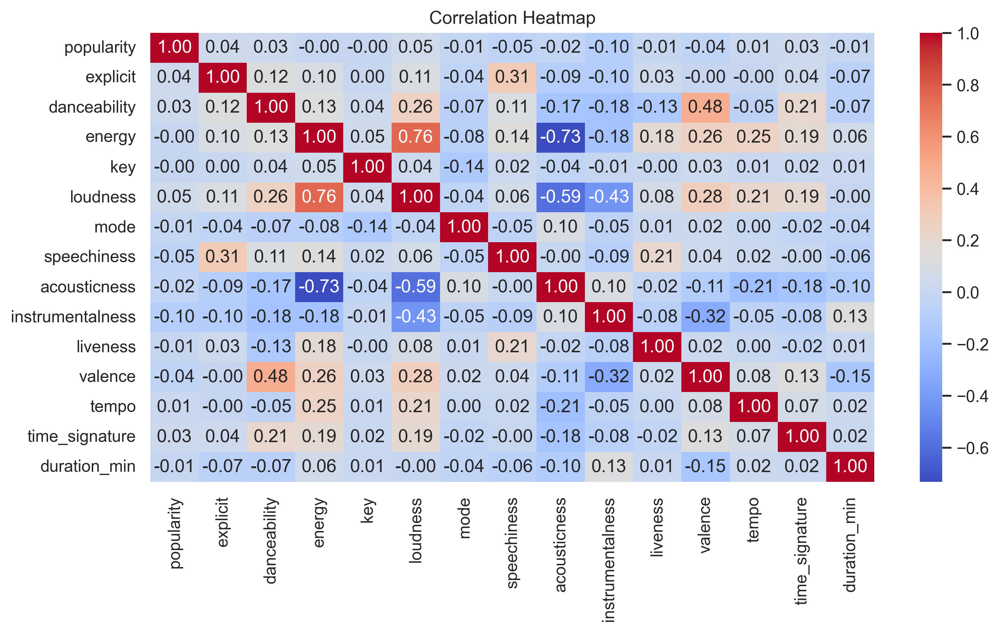
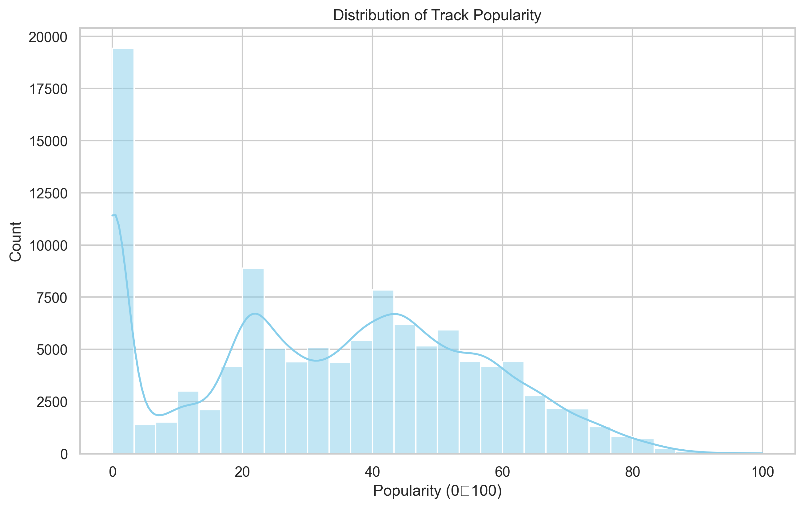
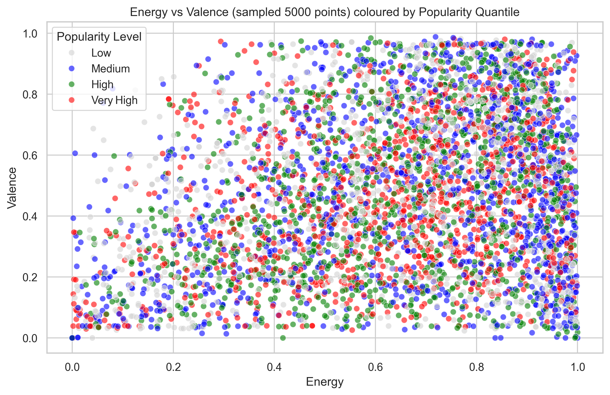
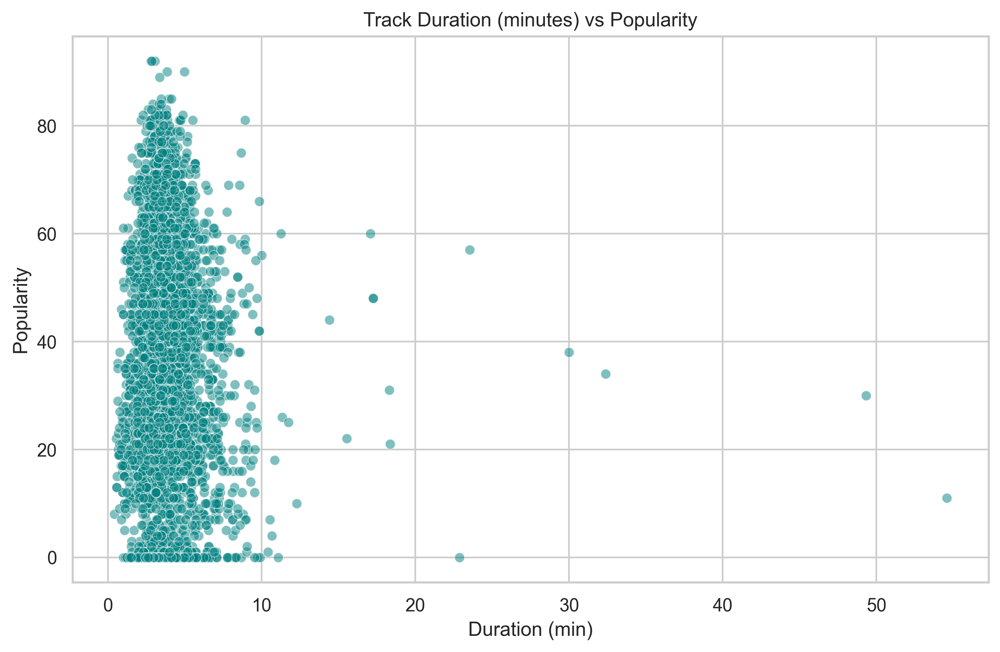
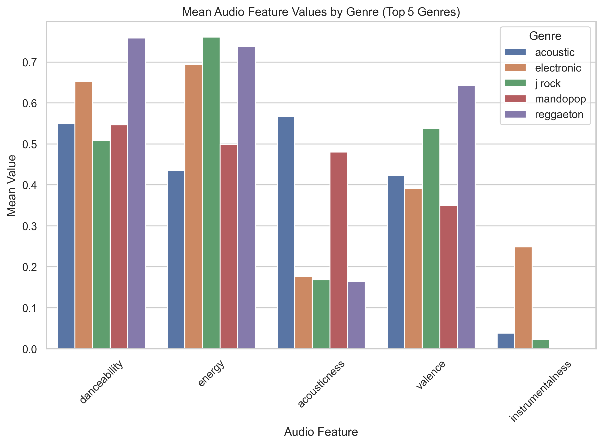
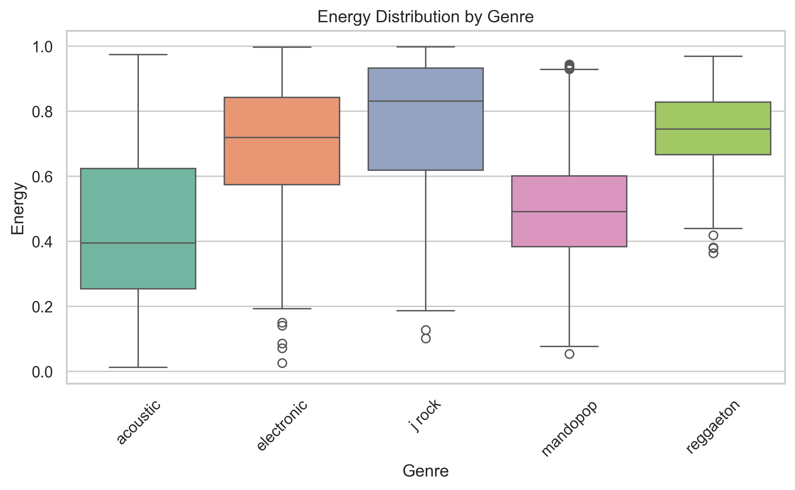
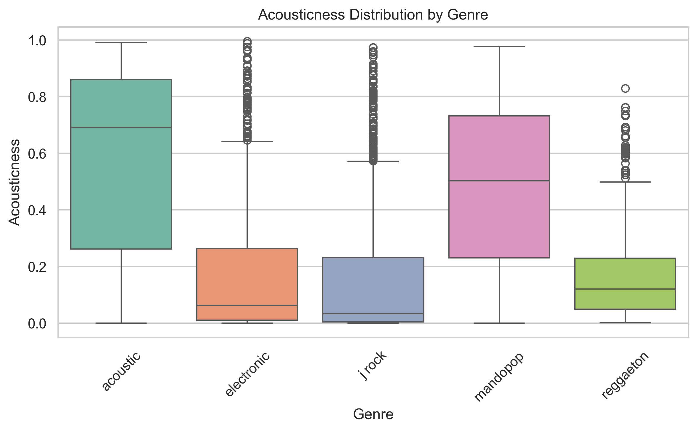
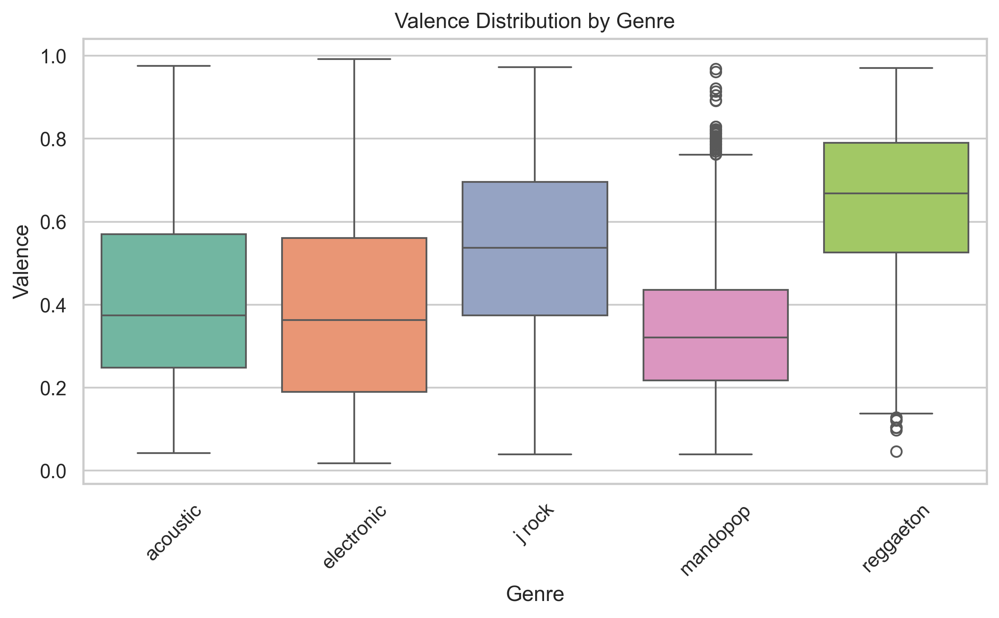
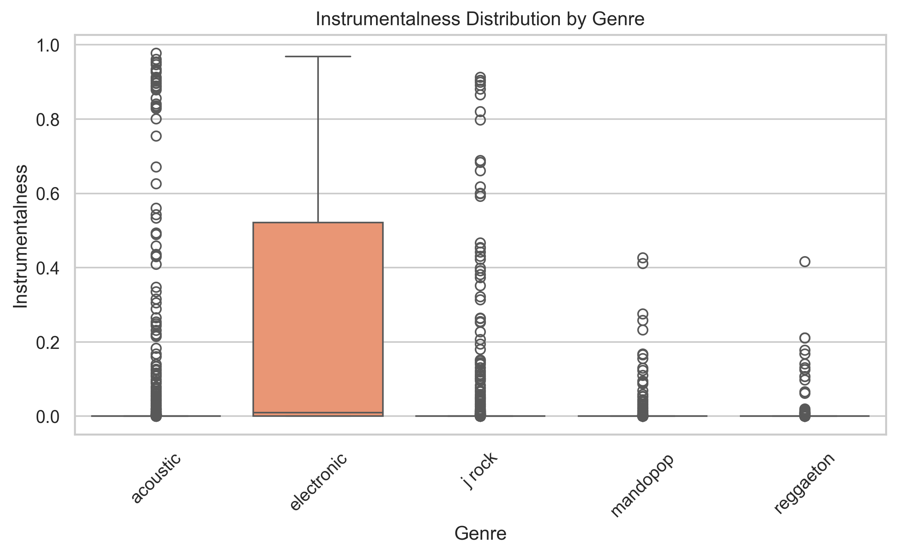

# Spotify Track Analytics

Analyze ~114k Spotify tracks to understand what drives popularity, explore mood/genre patterns, and prototype lightweight prediction tools for playlist building or A&R triage.

## SPOTIFY POPULARITY PREDICTOR (GRADIO DEMO)

Gradio on local host: Running on local [URL](http://127.0.0.1:7865)

## Business Problems and Goals
- What audio and metadata signals most influence a track’s popularity score (0–100)?
- Can we quickly triage large catalogs to surface likely hits or candidate tracks for playlists?
- How do energy/valence/danceability differ by macro-genre, and where are outliers worth A&R follow-up?
- Deliver simple, reproducible tooling (notebook widgets + Gradio demo) that product or data teams can test with minimal setup.

## Data
- Source: [Kaggle – Spotify Tracks Dataset](https://www.kaggle.com/datasets/maharshipandya/-spotify-tracks-dataset)
- Files: [raw data](https://github.com/YShutko/CI_spotify_track_analysis/blob/3c1d5b469e04c4a46cf01e3d99477fac8d672044/data/spotify_dataset.csv) and [cleaned dataset](https://github.com/YShutko/CI_spotify_track_analysis/blob/3c1d5b469e04c4a46cf01e3d99477fac8d672044/data/spotify_cleaned_data.csv) (preprocessed subset used in all notebooks).
- The dataset consists of the following columns:
  * track_id: Unique Spotify identifier for each track.
  * artists: List of artists performing the track, separated by semicolons.
  * album_name: Title of the album where the track appears.
  * track_name: Title of the song.
  * popularity: Score from 0–100 based on recent play counts; higher means more popular.
  * duration_ms: Length of the track in milliseconds.
  * explicit: Indicates whether the track contains explicit content (True/False).
  * danceability: Score (0.0–1.0) measuring how suitable the song is for dancing.
  * energy: Score (0.0–1.0) reflecting intensity, speed, and loudness.
  * key: Musical key using Pitch Class notation (0 = C, 1 = C♯/D♭, etc.).
  * loudness: Overall volume of the track in decibels.
  * mode: Indicates scale type (1 = major, 0 = minor).
  * speechiness: Score estimating spoken content in the track.
  * cousticness: Likelihood (0.0–1.0) that the song is acoustic.
  * instrumentalness: Probability that the track has no vocals.
  * liveness: Measures if the song was recorded live (higher = more live).
  * valence: Positivity of the music (0.0 = sad, 1.0 = happy).
  * tempo: Speed of the song in beats per minute (BPM).
  * time_signature: Musical meter (e.g. 4 = 4/4 time).
  * track_genre: Musical genre classification of the track.

## Repository Layout
* [Spotify_track_analysis.ipynb](https://github.com/YShutko/CI_spotify_track_analysis/blob/3c1d5b469e04c4a46cf01e3d99477fac8d672044/notebooks/Spotify_track_analysis.ipynb) – EDA, cleaning, feature exploration, visualizations (correlations, genre summaries, energy/valence scatter, duration vs popularity).
* [ml_models.ipynb](https://github.com/YShutko/CI_spotify_track_analysis/blob/3c1d5b469e04c4a46cf01e3d99477fac8d672044/notebooks/ml_models.ipynb) – Feature engineering and model training for popularity prediction.
* [ipywidgets.ipynb](https://github.com/YShutko/CI_spotify_track_analysis/blob/3c1d5b469e04c4a46cf01e3d99477fac8d672044/models_widgets/ipywidgets.ipynb) – In-notebook prediction widget (sliders/dropdowns) using downloaded models.
* [gradio.ipynb](https://github.com/YShutko/CI_spotify_track_analysis/blob/3c1d5b469e04c4a46cf01e3d99477fac8d672044/models_widgets/gradio.ipynb) – Gradio UI for quick web demos (multiple downloadable models).
* [flagged](https://github.com/YShutko/CI_spotify_track_analysis/blob/3c1d5b469e04c4a46cf01e3d99477fac8d672044/models_widgets/.gradio/flagged/dataset1.csv) – Sample flagged input from a previous Gradio run.
  
## Plot Highlights
* **Pairplot**
  
  
  
Key Insights:
1. Popularity shows no strong linear relationships
 * Scatterplots with popularity form wide clouds → no clear trend.
 * Confirms that simple linear models won’t work well.
2. Strong feature relationships exist between audio characteristics
 * Energy ↗ Loudness (clear strongest correlation)
 * Energy ↗ Danceability
 * Danceability ↗ Valence
 These justify the creation of interaction features (energy × valence, loudness × danceability).
3. Several features are highly skewed
 * Acousticness, instrumentalness, and speechiness show uneven distributions.
 * They add information but are not dominant predictors.
4. Some features carry a very minimal useful signal
 * Key, mode, and time_signature appear as vertical stripes (discrete, low-variance).
 * Correct choice to drop or de-prioritize them.
5. Duration and tempo show only weak relationships
 * Scatterplots reveal noisy clouds → limited influence on popularity.  

*  **Correlation Heatmap**
  

Overall Interpretation: 
The heatmap illustrates the relationship between different audio features of songs, with values ranging from –1 (strong negative correlation) to +1 (strong positive correlation). Most correlations are weak, indicating that the features are largely independent; however, there are a few notable strong relationships worth highlighting.

1. Key Positive Correlations (Strong/Moderate)
    * Feature Pair	Correlation	Interpretation
    * Energy ↔ Loudness	0.76	Louder tracks tend to have more energy.
    * Danceability ↔ Energy	0.28	More energetic tracks are slightly more danceable.
    * Valence ↔ Danceability	0.48	More danceable songs tend to have happier/positive vibes.
    * Liveness ↔ Acousticness	0.21	More live-sounding tracks tend to be more acoustic.
2. Strong Negative Correlations
    * Feature Pair	Correlation	Interpretation
    * Acousticness ↔ Energy	–0.73	Highly acoustic songs are much less energetic.
    * Acousticness ↔ Loudness	–0.59	Acoustic songs are generally quieter than others.
    * Instrumentalness ↔ Loudness	–0.43	Instrumental songs tend to be quieter.
3. Popularity shows very weak correlations with all features, meaning:
    * Popularity cannot be explained well by audio features alone.
    * External factors like marketing, artist reputation, playlisting, and trends likely drive popularity more than musical traits.
    * Highest (still weak) correlations with popularity:
        * Danceability (0.03)
        * Loudness (0.05) → Slight preference for louder songs
4. Additional Observations
    * Explicit content has no meaningful effect on popularity (correlation = 0.04).
    * Tempo, mode, and time signature have close to zero correlation with most metrics — musical structure isn't a major differentiator.
    * Instrumentalness is negatively related to energy and popularity, implying mainstream hits are normally non-instrumental and energetic.

 * **Distribution of Track Popularity**

   

  Key Insights:
1.  Most tracks are unpopular or unknown
    * Over 19,000 tracks have popularity = 0, which could mean:
    * They are newly added and haven’t been played yet.
    * They were rarely streamed.
    * The data source (Spotify API) couldn't retrieve popularity.
2. Popularity has a long tail
    * While some tracks have moderate to high popularity (20–60), very few exceed a score of 80.
    * Suggests a small subset of tracks dominate listener attention, which aligns with real-world streaming patterns (few “hits”, many “flops”).
3. The data is not normally distributed
    * Important for statistical testing: you’ll need to use non-parametric tests or apply transformations if comparing features against popularity.
      
 *  **Energy vs Valence (sampled 5000 points) coloured by Popularity Quantile**
   
  

The points are evenly spread across all areas of the plot. All four popularity levels (Low, Medium, High, Very High) are visually mixed, not clustered. There is a slightly higher concentration of “Very High” popularity tracks (red) in the top-right quadrant: High Energy + High Valence (i.e., loud AND happy music)

Key Insights:
1. High-energy, happy songs may be more popular
    * Tracks with both high energy and high valence seem to have more Very High popularity (red) points.
    * These could represent feel-good, danceable hits or radio-friendly tracks.
2. Popularity is not strictly tied to audio features
    * There are low-popularity tracks (grey) in every area, even among high-energy, high-valence music.
    * This suggests that while audio features help, they are not the sole drivers of popularity — marketing, artist fame, and release context also matter.
3.  Valence alone doesn’t strongly separate popularity levels
    * Tracks with low valence (sad/melancholic) can still be popular — see red dots in the lower-right (high energy, low valence = maybe aggressive or energetic sad songs).
      
   * **Popularity Distribution by Top 5 Genres**
  

  Each box represents the interquartile range (IQR) of track popularity within a genre. The horizontal line inside each box is the median popularity. Whiskers show min/max (excluding outliers). Circles below the whiskers are outliers (very low popularity).

Key Insights:
1. Electronic has the highest median popularity
    * Median is slightly higher than the others.
    * Also shows a wide spread, including many tracks with 0 popularity.
    * Could suggest that electronic music is broadly appealing, but also contains many niche/less played tracks.
2. Mandopop is the most consistent genre
    * Smallest spread of popularity.
    * Few outliers, tighter IQR → tracks tend to perform similarly in terms of popularity.
    * Suggests a stable, possibly regional audience.
3. Reggaeton is highly polarized
    * Extreme range from 0 to 100 popularity.
    * Has both the highest max value (outlier hit) and the lowest median.
    * Suggests that while some reggaeton tracks go viral, most remain very unpopular.
4. J Rock and Acoustic are middle-of-the-road
    * Median popularity is around 40–50
    * Contains many low-popularity outliers, but not as extreme as reggaeton

* **Track Duration (minutes) vs Popularity**
  

Most tracks range from 1 to 7 minutes in duration. The highest concentration of points (especially popular ones) is between 2 and 5 minutes.
A few outliers exist: Some tracks exceed 10, 20, or even 50 minutes, but they are not popular (mostly near 0). There's no visible linear correlation, but a clear trend in concentration.

Key Insights:
1. Popular songs cluster between 2 and 5 minutes
    * This aligns with industry norms for radio, streaming, and attention span.
    * Tracks outside this range (especially very long ones) are rarely popular.
2. Tracks longer than ~7–8 minutes seldom gain popularity
    * There are a few very long tracks, but they all have low popularity scores.
    * These may be:
        * Ambient, sleep, or experimental tracks
        * Audiobooks, meditation, or niche content mislabeled as music
3. Very short or very long songs are less successful
    * Almost all tracks shorter than 1 minute or longer than 10 minutes have a popularity near 0.
  
  * **Mean Audio Feature Values by Genre (Top 5 Genres)**
      

Key Insights by Feature
1. Danceability
    * Reggaeton has the highest danceability (expected – it's a dance genre).
    * Electronic and mandopop also rank high.
    * J-rock is the least danceable among the five.
2. Energy
    * J rock and reggaeton lead with very high energy (~0.75).
    * Electronic also scores high.
    * Acoustic genre has noticeably lower energy — consistent with its mellow sound.
3. Acousticness
    * Acoustic genre dominates here (as expected), with the highest score.
    * All other genres have significantly lower acousticness, especially reggaeton and electronic.
4. Valence (positivity/happiness)
    * Reggaeton has the happiest vibe, followed by J-Rock.
    * Mandopop shows the lowest valence (more emotionally neutral or melancholic on average).
5. Instrumentalness
    * Most genres have very low instrumentalness (near zero).
    * Electronic has a noticeable spike → suggests a higher proportion of instrumental tracks.
  
* **Boxplots: Feature distribution by genre**
   
  
  
   
    

* Danceability Distribution by Genre
    * Reggaeton and Electronic have the highest median danceability and less variability.
    * J Rock shows the lowest median, with a tighter range.
    * Acoustic and Mandopop genres show a wider spread of danceability values.
Insight: Genres like Reggaeton and Electronic are consistently danceable, while acoustic and mandopop vary more—likely due to more subgenre diversity.
* Energy Distribution by Genre
    * J Rock and Electronic have the highest energy levels.
    * Acoustic and Mandopop show a broader range, with acoustic having lower medians.
    * Reggaeton tracks are consistently energetic but slightly lower than J-Rock.
Insight: High-energy genres (electronic, J-rock) dominate in terms of intensity and loudness, making them suitable for high-energy environments like workouts or clubs.
* Acousticness Distribution by Genre
    * Acoustic genre is exactly as expected—very high acousticness.
    * Mandopop has the second-highest median and variability.
    * Electronic and J Rock are highly electronic (very low acousticness).
Insight: This validates the genre labeling — acoustic tracks rely on real instruments, while electronic and j rock are more digitally produced.
* Valence Distribution by Genre
    * Reggaeton has the highest median valence (more cheerful/happy).
    * Mandopop tends toward lower valence, indicating more somber or emotional tones.
    * J Rock and Electronic are moderate.
    * Insight: Reggaeton tends to have happier vibes; mandopop is more emotional or serious.
* Instrumentalness Distribution by Genre
    * Electronic is the only genre with a wide range and significant values above 0.5, indicating many tracks with little or no vocals.
    * All other genres (including acoustic and mandopop) have low instrumentalness (mostly vocal-driven).
Insight: Instrumental tracks are almost exclusively found in electronic music in this dataset. Other genres are mainly vocal.

**Conclusion**

The EDA reveals clear signals in the audio features: popularity skews right (most tracks sit in the lower bins), and higher energy/valence/danceability with moderate tempo cluster toward more popular tracks. Genre patterns emerge but with overlapping distributions; boxplots and heatmaps highlight that no single feature dominates, yet combinations of energy, loudness, and valence matter. This cleaned, feature-aware dataset is now ready for modeling—next steps are to validate these observations with ML models (see ml_models.ipynb), compare feature importances, and test genre-specific or feature-engineered variants to boost predictive power.
 
## Models and Comparison (from [ml_models.ipynb](https://github.com/YShutko/CI_spotify_track_analysis/blob/3c1d5b469e04c4a46cf01e3d99477fac8d672044/notebooks/ml_models.ipynb))
1. **Linear Regression**
Model Description: Linear Regression predicts popularity as a weighted linear combination of audio features. It assumes straight-line relationships between the inputs and the target.

Model:
* Simple, transparent baseline
* Shows whether popularity can be explained linearly
* Coefficients allow easy interpretatio

Performance: MAE: ~14.17. R²: ~0.25

Popularity is not linearly predictable, confirming the need for more flexible models.

2. **Random Forest** (300 trees)
Random Forest is an ensemble of many decision trees. Each tree captures different non-linear patterns, and their averaged output stabilizes predictions.

Model:
* Handles non-linear relationships extremely well
* Robust to noise and outliers
* Works with mixed feature types
* Provides feature importance

Hyperparameters. 

Performance: MAE: ~4.86, RMSE: ~9.98, R²: ~0.801

A major improvement over Linear Regression.
Random Forest shows that non-linear audio patterns + artist popularity explain a large portion of popularity variance.

3. **XGBoost Regressor**
XGBoost is a gradient-boosted tree model where each tree corrects the errors of the previous ones. It is one of the strongest algorithms for structured/tabular data.

Model:
* Captures complex patterns
* Regularized to avoid overfitting
* Efficient and scalable
* Produces stable feature importances

Hyperparameter Tuning (RandomizedSearchCV)

Best Parameters Found

Performance (After Tuning): MAE: ~5.11, RMSE: ~9.99, R²: ~0.800

Nearly identical performance to Random Forest.
XGBoost is slightly smoother and more regularized, but not significantly better on this dataset.

**Model Comparison Summary**
  
  | Model                 | MAE ↓    | RMSE ↓   | R² ↑      | Notes                                          |
| --------------------- | -------- | -------- | --------- | ---------------------------------------------- |
| **Linear Regression** | ~14.17   | ~19.32   | ~0.25     | Weak performance; linear patterns insufficient |
| **Random Forest**     | **4.86** | **9.98** | **0.801** | Best overall; strong non-linear learning       |
| **XGBoost (tuned)**   | 5.11     | 9.99     | 0.800     | Competitive with RF; highly regularized        |

**ML Conclusion**
* Popularity cannot be modeled using simple linear methods → Linear Regression performs poorly.
* Tree-based models (Random Forest, XGBoost) capture the underlying non-linear structure extremely well.
* Both RF and tuned XGBoost reach ~0.80 R², meaning the models successfully explain ~80% of popularity variance.
* Random Forest achieved the best overall metrics, while XGBoost provides similar performance with more tunability and regularization options.
* Feature importance analyses show one dominant predictor—artist popularity—followed by tempo, valence, speechiness, and interaction features.

## Interactive Prediction Tools
- **Notebook widget ([ipywidgets.ipynb](https://github.com/YShutko/CI_spotify_track_analysis/blob/3c1d5b469e04c4a46cf01e3d99477fac8d672044/models_widgets/ipywidgets.ipynb))**  
  Downloads a selected model from the [Hugging Face repo](https://huggingface.co/YShutko/spotify-popularity-models/tree/main), loads macro-genre options from the cleaned data, and exposes sliders/dropdowns to test popularity predictions inline.
- **Gradio app ([gradio.ipynb](https://github.com/YShutko/CI_spotify_track_analysis/blob/3c1d5b469e04c4a46cf01e3d99477fac8d672044/models_widgets/gradio.ipynb))**  
  Loads multiple Hugging Face models and builds a Gradio UI with sliders and a genre dropdown. Use it to share a quick web demo; Gradio handles launching and optional sharing links. (Note: Ensure the selected model is passed through in the predict function before production use.)

## Suggested Workflow
1) Use [cleaned dataset](https://github.com/YShutko/CI_spotify_track_analysis/blob/3c1d5b469e04c4a46cf01e3d99477fac8d672044/data/spotify_cleaned_data.csv) to skip heavy preprocessing.
2) Run [Spotify_track_analysis.ipynb](https://github.com/YShutko/CI_spotify_track_analysis/blob/3c1d5b469e04c4a46cf01e3d99477fac8d672044/notebooks/Spotify_track_analysis.ipynb) to explore distributions, correlations, and genre-level mood/energy patterns.
3) Train and compare models in [ml_models.ipynb](https://github.com/YShutko/CI_spotify_track_analysis/blob/3c1d5b469e04c4a46cf01e3d99477fac8d672044/notebooks/ml_models.ipynb); focus on RF vs tuned XGB.
4) Demo predictions with the ipywidgets notebook or the Gradio app for stakeholder feedback.

## Conclusion
- Popularity is predictable with tree-based models using standard audio features; RF and tuned XGB achieve MAE ≈ 5–5.1 and R² ≈ 0.80 on this dataset.
- Macro-genre and energy/valence interactions remain useful signals for triage; additional metadata (artist history, release timing) could further reduce error.
- The Gradio and notebook widgets provide fast, shareable prototypes for product or A&R teams; harden by validating model selection wiring and adding input validation if deploying beyond experiments.
